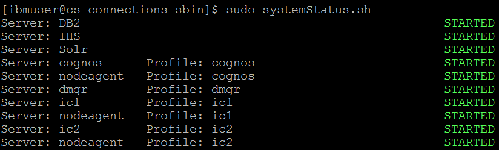
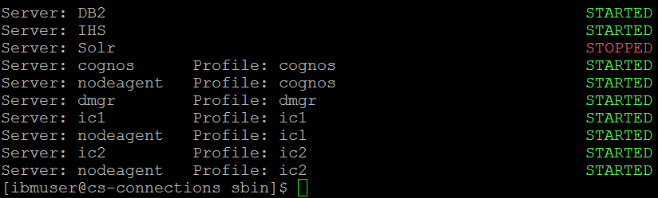

## systemStatus

The systemStatus command gives you an overview of the state of a particular Connections node. Stopped and started
services are clearly identified, allowing you to quickly determine what actions need to be taken.

## Example 1: A healthy system

## Example 2: An unhealthy system

